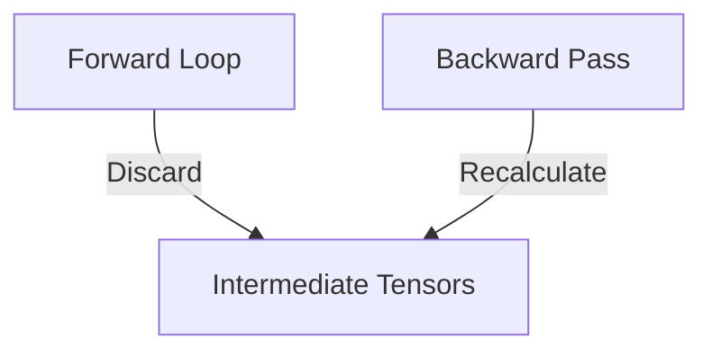

# Activation Checkpointing

Memory footprint compression technique discarding intermediate activation tensors and recalculating them on-the-fly.

## Diagram

Keeps VRAM utilization beneath physical GPU limits.
