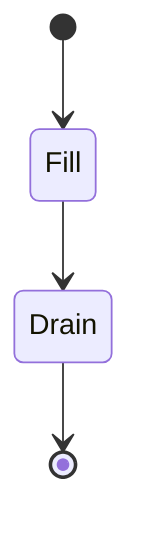

# GPipe Schedule (Fill-Drain Pipelining)

Processes all forward micro-batches continuously across the pipeline cards before initiating backward passes.

## Diagram

Peak activation memory footprints scale linearly with the number of micro-batches.
