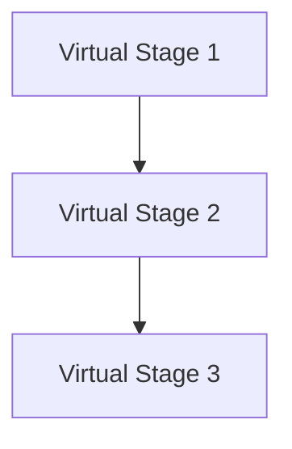

# Interleaved 1F1B Schedule

Sub-divides each physical GPU process into multiple virtual stages holding non-contiguous blocks of layers.

## Diagram

```mermaid
flowchart TD
    V1[Virtual Stage 1] --> V2[Virtual Stage 2]
    V2 --> V3[Virtual Stage 3]
```

Slashed bubble overhead dramatically.
