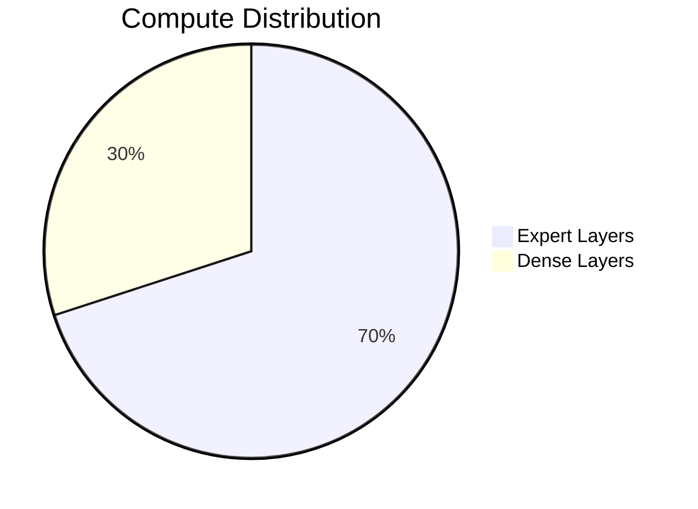

# The Load Imbalance Wall

Modern architectures with massive expert parameters cause severe load imbalance when cut uniformly.

## Diagram

```mermaid
pie title Compute Distribution
    "Expert Layers" : 70
    "Dense Layers" : 30
```

Mitigated by adaptive layer profiling.
