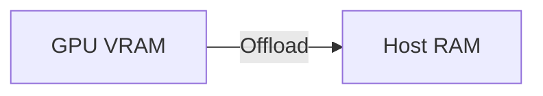

# The Activation Memory Accumulation Crisis

Physical volume of un-reduced activation maps explodes as pipeline depth expands.

## Diagram

```mermaid
flowchart LR
    GPU[GPU VRAM] -->|Offload| CPU[Host RAM]
```

Mitigated by Asynchronous Activation Swapping.
