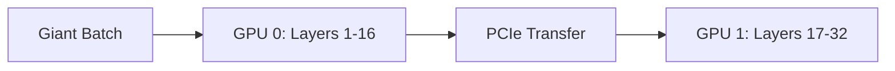

# The Naive Model-Parallel Era

This era represents the early distributed baseline where deep neural networks were chopped raw across hardware bounds. 

## Diagram

It suffered from catastrophic hardware underutilization due to idle periods.
