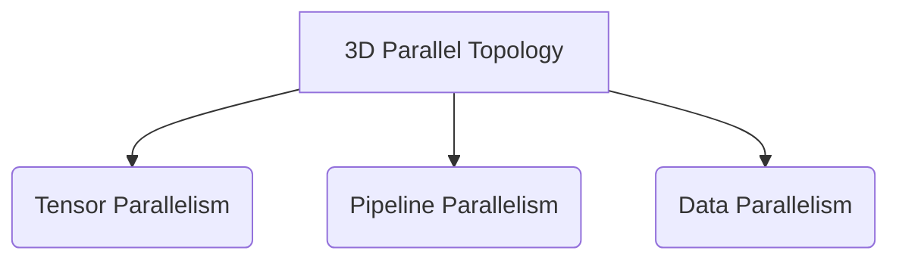

# Pre-Training Trillion-Parameter Foundational LLMs

Crucial structural backbone for training elite base architectures like Llama 3 and DeepSeek-V3.

## Diagram

Splitting massive parameter structures across thousands of GPUs cleanly.
