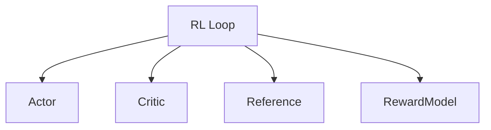

# Enterprise Post-Training On-Policy RL Alignment

Powers distributed alignment loops for advanced reasoning models requiring multiple networks in VRAM concurrently.

## Diagram

Cuts parallel networks across isolated node shards.
