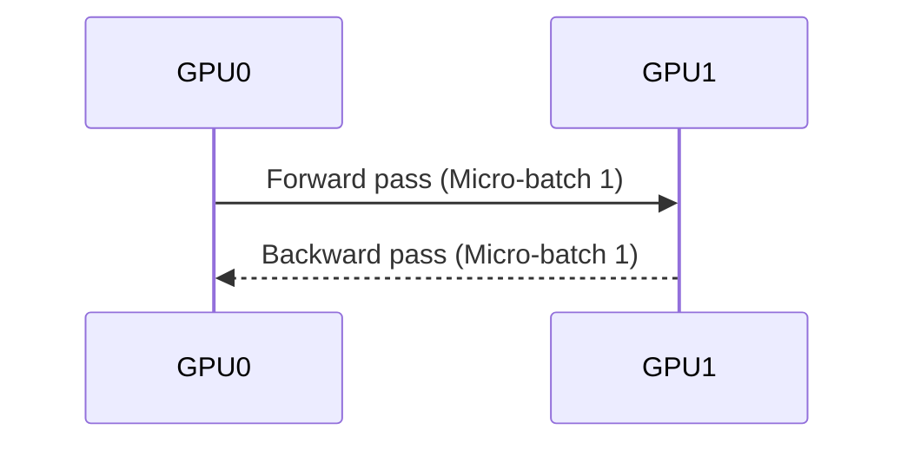

# The Synchronous Pipelining Revolution (GPipe / 1F1B)

Dismantled the naive model-parallel wall by introducing the 1F1B execution schedule popularized by Google's GPipe.

## Diagram

Workload is fractured into independent micro-batches to stabilize memory allocations.
