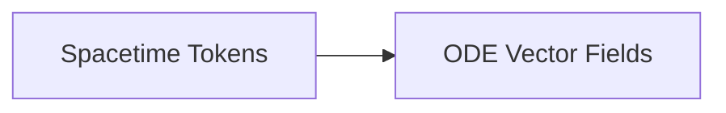

# High-Volume Spatio-Temporal Video Generation Scaling

Coordinates large-scale video simulation networks where massive 3D spacetime token cubes are sharded.

## Diagram

Allows ODE vector fields to optimize over multi-megapixel video sequences concurrently.
