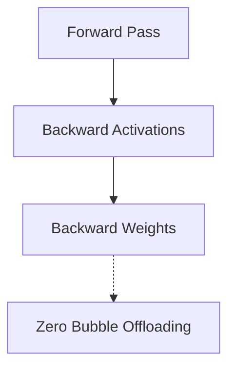

# The Zero-Bubble Era

The current modern state-of-the-art infrastructure standard built to scale across frontier trillion-parameter foundation clusters.

## Diagram

It decouples backward passes into independent operations.
